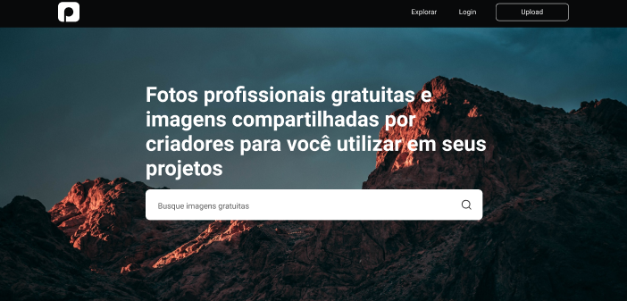
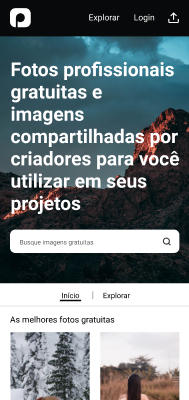
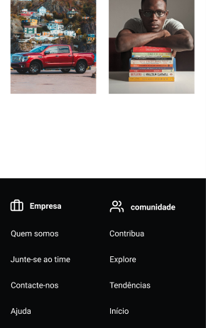
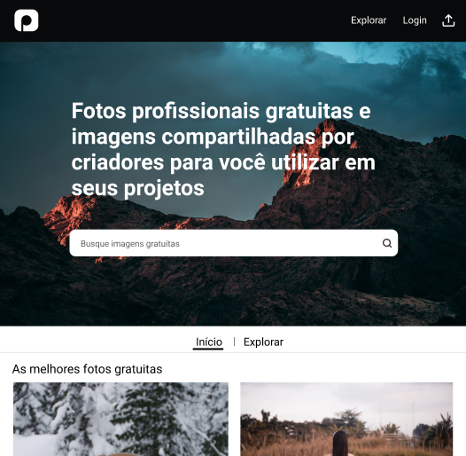
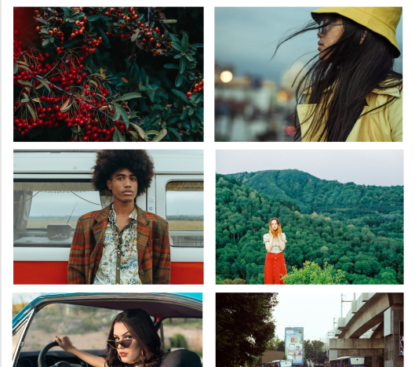

<h4 align="center"> 
	🚧  Photolead 📸 🚧
</h4>


<h1 align="center">
    
</h1>

<p align="center">
 <a href="#-sobre-o-projeto">Sobre</a> •
 <a href="#-funcionalidades">Funcionalidades</a> •
 <a href="#-layout">Layout</a> •
 <a href="#-tecnologias">Tecnologias</a> •
 <a href="#-autor">Autor</a> • 
 <a href="#user-content--licença">Licença</a>
</p>

## 💻 Sobre o projeto

📸 Photolead é uma site que consome dados da API do Pexels e exibe fotos ao usuários quando este faz uma busca por uma palavra chave.

---

## ⚙️ Funcionalidades

- [x] Você pode fazer uma busca por imagens direto do Pexels
- [x] Ver até 50 resultados por pesquisa
- [x] Design responsivo para diversas telas

### Em breve

- Poder fazer upload de uma imagem para um banco de dados:
  - não é o do pexels, e sim um próprio só para exibir a funcionalidade
- Poder carregar mais de 50 resultados por página
- Navegar entre páginas de resultados
- Recurso de surpreender-se
  - Ao clicar nesta aba receber imagens escolhidas a dedo pelos colaboradores do pexels api

---

## 🎨 Layout

O layout da aplicação está disponível no Figma:

<a href="https://www.figma.com/file/IR5aK42bpupEnjRisR67CS/PhotoLead?node-id=0%3A1">
  
</a>

### Mobile

<p align="center">
  

  
</p>

### Tablet

<p align="center" style="display: flex; align-items: flex-start; justify-content: center;">
  

  
</p>

---

#### 🧭 Rodando a aplicação web (Frontend)

```bash
# Clone este repositório
$ git clone github.com/NeiltonSeguins/photo-lead.git
# Acesse a pasta do projeto no seu terminal/cmd
$ cd photolead
# Instale as dependências
$ npm install
# Execute a aplicação em modo de desenvolvimento
$ npm run start
# A aplicação será aberta na porta:3000 - acesse http://localhost:3000
```

---

## 🛠 Tecnologias

As seguintes ferramentas foram usadas na construção do projeto:

#### **Website**

- **[React](https://reactjs.org/)**
- **[Sass](https://sass-lang.com/)**

#### **Utilitários**

- Protótipo: **[Figma](https://www.figma.com/)** → **[Protótipo (Photolead)](https://www.figma.com/file/IR5aK42bpupEnjRisR67CS/PhotoLead?node-id=0%3A1)**
- API: **[PEXELS API](https://www.pexels.com/pt-br/api/documentation/)**
- Editor: **[Visual Studio Code](https://code.visualstudio.com/)**
- Ícones: **[Feather Icons](https://feathericons.com/)**, **[Flaticon](https://www.flaticon.com)**
- Fontes: **[Poppins](https://fonts.google.com/specimen/Poppins)**

---

## 🦸 Autor

<a href="https://www.instagram.com/ncode.io/">
 
 <br />
 <sub><b>Neilton Seguins</b></sub></a> <a href="https://www.linkedin.com/in/tgmarinho/" title="Photolead">🚀</a>
 <br />

[](https://www.linkedin.com/in/tgmarinho/)
[](mailto:seguins.neilton@gmail.com)

---

## 📝 Licença

Feito por Neilton Seguins 👋🏽 [Entre em contato!](https://www.linkedin.com/in/ne%C3%ADlton-seguins-bb8786a6/)

---
